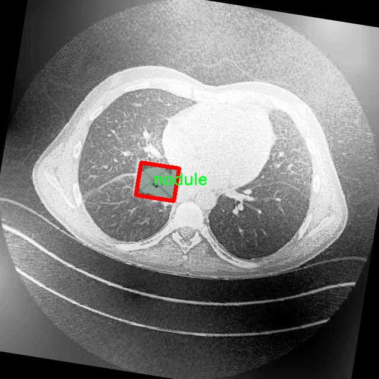

# 肺结节图像分割系统： yolov8-seg-LAWDS

### 1.研究背景与意义

[参考博客](https://gitee.com/YOLOv8_YOLOv11_Segmentation_Studio/projects)

[博客来源](https://kdocs.cn/l/cszuIiCKVNis)

研究背景与意义

肺结节的早期检测与诊断对于降低肺癌的死亡率至关重要。根据世界卫生组织的统计数据，肺癌已成为全球范围内导致癌症相关死亡的主要原因之一。肺结节的出现往往是肺癌的早期信号，因此，准确、快速地识别和分割肺结节图像对于临床决策和患者预后具有重要意义。传统的肺结节检测方法依赖于放射科医生的经验和判断，然而，随着医学影像数据量的急剧增加，人工分析的效率和准确性面临着严峻挑战。因此，基于深度学习的自动化图像分割技术逐渐成为研究的热点。

在众多深度学习模型中，YOLO（You Only Look Once）系列因其高效的实时目标检测能力而受到广泛关注。YOLOv8作为该系列的最新版本，具备了更强的特征提取能力和更快的处理速度，适合用于医学图像分析。尽管YOLOv8在目标检测领域表现出色，但在肺结节图像分割任务中仍存在一定的局限性，尤其是在处理小尺寸结节和复杂背景时。因此，改进YOLOv8以增强其在肺结节图像分割中的表现，具有重要的学术价值和实际意义。

本研究将基于改进的YOLOv8模型，构建一个高效的肺结节图像分割系统。所使用的数据集包含1600幅图像，涵盖了三类重要的病理类型：腺癌、癌症和结节。这些数据不仅为模型的训练提供了丰富的样本，也为后续的模型评估和验证奠定了基础。通过对不同类别的肺结节进行精确分割，研究旨在提高模型在实际应用中的鲁棒性和准确性，进而为临床医生提供更为可靠的辅助诊断工具。

此外，肺结节的图像分割研究不仅具有临床应用价值，也为深度学习在医学影像分析中的应用提供了新的思路。通过改进YOLOv8模型，研究将探索深度学习技术在复杂医学图像处理中的潜力，推动相关领域的研究进展。该研究的成果有望为肺结节的早期检测和诊断提供新的技术支持，促进个性化医疗的发展，最终提高患者的生存率和生活质量。

综上所述，基于改进YOLOv8的肺结节图像分割系统的研究，不仅响应了医学影像分析领域对高效、准确的自动化工具的迫切需求，也为深度学习技术在医学领域的应用探索提供了新的方向。通过本研究，期望能够为肺结节的早期识别和治疗提供有力支持，推动肺癌防治工作的进展。

### 2.图片演示


注意：本项目提供完整的训练源码数据集和训练教程,由于此博客编辑较早,暂不提供权重文件（best.pt）,需要按照6.训练教程进行训练后实现上图效果。

### 3.视频演示

[3.1 视频演示](https://www.bilibili.com/video/BV1xRUtYSEvB/)

### 4.数据集信息

##### 4.1 数据集类别数＆类别名

nc: 3
names: ['adenocarsinoma', 'cancer', 'nodule']


##### 4.2 数据集信息简介

数据集信息展示

在肺结节图像分割的研究中，数据集的选择与构建至关重要。本研究所采用的数据集名为“Lung Nodule Segmentation study”，其设计旨在为改进YOLOv8-seg模型提供高质量的训练数据。该数据集专注于肺部影像中的结节分割，特别是针对不同类型的肺结节进行精确标注，以便于后续的深度学习模型训练和性能评估。

“Lung Nodule Segmentation study”数据集中包含三种主要类别，分别为腺癌（adenocarcinoma）、癌症（cancer）和结节（nodule）。这些类别的选择不仅反映了肺部影像学中的常见病理类型，也为模型的多样性和适应性提供了基础。腺癌作为一种常见的肺癌类型，其在影像学上的表现与其他类型的肺结节有显著差异，因此在数据集中占据了重要地位。癌症这一类别则涵盖了更广泛的病理变化，旨在提高模型对不同癌症类型的识别能力。结节类别则是数据集的核心，主要用于训练模型在图像中准确识别和分割出肺结节的区域。

数据集的构建过程中，研究团队采用了高标准的影像采集和标注流程，确保每一幅图像的质量和标注的准确性。影像数据主要来源于临床病例，经过严格筛选和预处理，以去除噪声和伪影，确保模型训练的有效性。每一幅图像都经过专业放射科医师的标注，确保了类别标签的准确性和一致性。这种高质量的标注不仅提高了模型的训练效果，也为后续的模型评估提供了可靠的基准。

在数据集的使用过程中，研究者们还特别关注了类别不平衡的问题。由于不同类型的肺结节在临床中的发生率不同，腺癌和癌症的样本数量可能会显著少于结节类别。为了解决这一问题，研究团队采用了数据增强技术，通过旋转、缩放、翻转等方式扩充数据集，增加了少数类别的样本数量，从而提高了模型对各类别的识别能力。

此外，数据集还提供了丰富的元数据，包括影像的获取时间、患者的基本信息、影像的分辨率等。这些信息不仅有助于研究者深入分析模型的表现，还为未来的研究提供了重要的参考依据。通过对不同类别的肺结节进行系统的分析，研究者们希望能够揭示其在影像学特征上的差异，从而为临床诊断提供更为精准的支持。

总之，“Lung Nodule Segmentation study”数据集的构建与应用为改进YOLOv8-seg的肺结节图像分割系统提供了坚实的基础。通过对数据集的精心设计与实施，研究团队不仅希望提升模型的分割精度，更希望能够为肺结节的早期诊断和治疗提供有力的技术支持。随着研究的深入，该数据集将为未来的肺部影像学研究和深度学习应用提供持续的动力和支持。




### 5.项目依赖环境部署教程（零基础手把手教学）

[5.1 环境部署教程链接（零基础手把手教学）](https://www.bilibili.com/video/BV1jG4Ve4E9t/?vd_source=bc9aec86d164b67a7004b996143742dc)


[5.2 安装Python虚拟环境创建和依赖库安装视频教程链接（零基础手把手教学）](https://www.bilibili.com/video/BV1nA4VeYEze/?vd_source=bc9aec86d164b67a7004b996143742dc)

### 6.手把手YOLOV8-seg训练视频教程（零基础手把手教学）

[6.1 手把手YOLOV8-seg训练视频教程（零基础小白有手就能学会）](https://www.bilibili.com/video/BV1cA4VeYETe/?vd_source=bc9aec86d164b67a7004b996143742dc)


按照上面的训练视频教程链接加载项目提供的数据集，运行train.py即可开始训练



     Epoch   gpu_mem       box       obj       cls    labels  img_size
     1/200     0G   0.01576   0.01955  0.007536        22      1280: 100%|██████████| 849/849 [14:42<00:00,  1.04s/it]
               Class     Images     Labels          P          R     mAP@.5 mAP@.5:.95: 100%|██████████| 213/213 [01:14<00:00,  2.87it/s]
                 all       3395      17314      0.994      0.957      0.0957      0.0843

     Epoch   gpu_mem       box       obj       cls    labels  img_size
     2/200     0G   0.01578   0.01923  0.007006        22      1280: 100%|██████████| 849/849 [14:44<00:00,  1.04s/it]
               Class     Images     Labels          P          R     mAP@.5 mAP@.5:.95: 100%|██████████| 213/213 [01:12<00:00,  2.95it/s]
                 all       3395      17314      0.996      0.956      0.0957      0.0845

     Epoch   gpu_mem       box       obj       cls    labels  img_size
     3/200     0G   0.01561    0.0191  0.006895        27      1280: 100%|██████████| 849/849 [10:56<00:00,  1.29it/s]
               Class     Images     Labels          P          R     mAP@.5 mAP@.5:.95: 100%|███████   | 187/213 [00:52<00:00,  4.04it/s]
                 all       3395      17314      0.996      0.957      0.0957      0.0845


### 7.50+种全套YOLOV8-seg创新点加载调参实验视频教程（一键加载写好的改进模型的配置文件）

[7.1 50+种全套YOLOV8-seg创新点加载调参实验视频教程（一键加载写好的改进模型的配置文件）](https://www.bilibili.com/video/BV1Hw4VePEXv/?vd_source=bc9aec86d164b67a7004b996143742dc)

### YOLOV8-seg算法简介

原始YOLOv8-seg算法原理

YOLOv8-seg算法是Ultralytics团队在YOLOv5的基础上进行的进一步发展，旨在提升目标检测和分割任务的性能。自2023年1月发布以来，YOLOv8-seg吸收了近两年半内的多项技术改进，形成了一个高效且精确的深度学习模型。该模型的设计理念在于兼顾实时性与准确性，尤其适用于复杂环境下的目标检测和分割任务。

YOLOv8-seg的网络结构由多个模块组成，包括输入端、主干网络、颈部网络和输出端。输入端负责对输入图像进行预处理，采用了Mosaic数据增强、自适应图片缩放和灰度填充等技术，以提升模型的鲁棒性和泛化能力。然而，YOLOv8在训练的最后10个epoch中停止使用Mosaic数据增强，以避免数据增强对真实分布的破坏，从而确保模型学习到更为真实的信息。

在主干网络方面，YOLOv8-seg采用了C2f模块替代了传统的C3模块。C2f模块的设计灵感来源于YOLOv7中的ELAN结构，增加了更多的跳层连接，这一改进不仅增强了梯度流的丰富性，还有效地减轻了模型的计算负担。SPPF模块依然保留在主干网络中，保证了特征提取的高效性和准确性，同时减少了执行时间。

颈部网络则采用了PAN（Path Aggregation Network）结构，通过上采样和下采样的方式对不同尺度的特征图进行融合，以便更好地捕捉目标的多尺度特征。此部分的改进在于将所有的C3模块更改为C2f模块，并删除了两处上采样之前的卷积连接层，从而简化了网络结构，提升了计算效率。

在输出端，YOLOv8-seg引入了解耦头的概念，将分类和回归任务分为两条并行的分支。这种设计使得模型在处理分类和定位任务时可以更加专注于各自的特征，从而提高了收敛速度和预测精度。具体而言，分类任务更注重于特征图中提取到的特征与已有类别的相似度，而定位任务则更关注边界框与真实框之间的关系。这种解耦设计使得YOLOv8-seg在复杂场景下的表现更加优越。

YOLOv8-seg的另一个重要特性是采用了无锚框结构，直接预测目标的中心位置。为了提升模型的任务对齐能力，YOLOv8-seg引入了任务对齐学习（Task Alignment Learning，TAL）机制，通过分类分数和IOU的高次幂乘积来衡量任务对齐的程度。这一机制的引入，使得模型在分类和定位损失函数中都能够有效地整合这项指标，从而提升了模型的整体性能。

在模型的训练过程中，YOLOv8-seg采用了BCE（Binary Cross-Entropy）损失函数来计算分类损失，同时使用DFL（Distribution Focal Loss）和CIoU（Complete Intersection over Union）损失函数来计算回归损失。这种损失函数的选择使得模型在面对不平衡数据时，能够更好地调整学习策略，从而提高检测精度。

YOLOv8-seg在检测结果上表现出色，尤其是在COCO数据集上的评估中，模型在同尺寸下的参数量并未显著增加，但精度却有了明显提升。与其他YOLO系列模型相比，YOLOv8-seg在推理速度上也表现得更加迅速，且精度保持在一个较高的水平。这一系列的改进使得YOLOv8-seg在实际应用中展现出了更高的实用价值，尤其是在需要实时检测和分割的场景中，如自动驾驶、安防监控和机器人视觉等领域。

总的来说，YOLOv8-seg算法通过一系列结构上的创新和技术上的改进，成功地在目标检测和分割任务中实现了更高的准确性和更快的推理速度。它的设计理念和实现方法为后续的研究和应用提供了宝贵的参考，尤其是在复杂环境下的目标检测和分割任务中，YOLOv8-seg无疑是一种值得关注的选择。随着技术的不断进步，YOLOv8-seg有望在更多的实际应用中发挥其潜力，推动计算机视觉领域的发展。


### 9.系统功能展示（检测对象为举例，实际内容以本项目数据集为准）

图9.1.系统支持检测结果表格显示

  图9.2.系统支持置信度和IOU阈值手动调节

  图9.3.系统支持自定义加载权重文件best.pt(需要你通过步骤5中训练获得)

  图9.4.系统支持摄像头实时识别

  图9.5.系统支持图片识别

  图9.6.系统支持视频识别

  图9.7.系统支持识别结果文件自动保存

  图9.8.系统支持Excel导出检测结果数据


### 10.50+种全套YOLOV8-seg创新点原理讲解（非科班也可以轻松写刊发刊，V11版本正在科研待更新）

#### 10.1 由于篇幅限制，每个创新点的具体原理讲解就不一一展开，具体见下列网址中的创新点对应子项目的技术原理博客网址【Blog】：


[10.1 50+种全套YOLOV8-seg创新点原理讲解链接](https://gitee.com/qunmasj/good)

#### 10.2 部分改进模块原理讲解(完整的改进原理见上图和技术博客链接)【如果此小节的图加载失败可以通过CSDN或者Github搜索该博客的标题访问原始博客，原始博客图片显示正常】

### YOLOv8简介
YOLOv8是一种目标检测模型，是基于YOLO (You Only Look Once)系列算法发展而来的最新版本。它的核心思想是将目标检测任务转化为一个回归问题，通过单次前向传播即可直接预测出图像中的多个目标的位置和类别。
YOLOv8的网络结构采用了Darknet作为其主干网络，主要由卷积层和池化层构成。与之前的版本相比，YOLOv8在网络结构上进行了改进，引入了更多的卷积层和残差模块，以提高模型的准确性和鲁棒性。
YOLOv8采用了一种特征金字塔网络(Feature Pyramid Network,FPN)的结构，通过在不同层级上融合多尺度的特征信息，可以对不同尺度的目标进行有效的检测。此外，YOLOv8还引入了一种自适应感知域(Adaptive Anchors
的机制，通过自适应地学习目标的尺度和
长宽比，提高了模型对于不同尺度和形状目标的检测效果。
总体来说，YOLOv8结构模型综合了多个先进的目标检测技术，在保证检测速度的同时提升了检测精度和鲁棒性，被广泛应用于实时目标检测任务中。


#### yolov8网络模型结构图

YOLOv8 (You Only Look Once version 8)是一种目标检测算法，它在实时场景下可以快速准确地检测图像中的目标。
YOLOv8的网络模型结构基于Darknet框架，由一系列卷积层、池化层和全连接层组成。主要包含以下几个组件:
1.输入层:接收输入图像。
2.卷积层:使用不同尺寸的卷积核来提取图像特征。
3.残差块(Residual blocks):通过使用跳跃连接(skip connections）来解决梯度消失问题，使得网络更容易训练。
4.上采样层(Upsample layers):通过插值操作将特征图的尺寸放大，以便在不同尺度上进行目标检测。
5.池化层:用于减小特征图的尺寸，同时保留重要的特征。
6.1x1卷积层:用于降低通道数，减少网络参数量。
7.3x3卷积层:用于进—步提取和组合特征。
8.全连接层:用于最后的目标分类和定位。
YOLOv8的网络结构采用了多个不同尺度的特征图来检测不同大小的目标，从而提高了目标检测的准确性和多尺度性能。
请注意，YOLOv8网络模型结构图的具体细节可能因YOLO版本和实现方式而有所不同。


#### yolov8模型结构
YOLOv8模型是一种目标检测模型，其结构是基于YOLOv3模型进行改进的。模型结构可以分为主干网络和检测头两个部分。
主干网络是一种由Darknet-53构成的卷积神经网络。Darknet-53是一个经过多层卷积和残差连接构建起来的深度神经网络。它能够提取图像的特征信息，并将这些信息传递给检测头。
检测头是YOLOv8的关键部分，它负责在图像中定位和识别目标。检测头由一系列卷积层和全连接层组成。在每个检测头中，会生成一组锚框，并针对每个锚框预测目标的类别和位置信息。
YOLOv8模型使用了预训练的权重，其中在COCO数据集上进行了训练。这意味着该模型已经通过大规模数据集的学习，具有一定的目标检测能力。

### RT-DETR骨干网络HGNetv2简介
#### RT-DETR横空出世
前几天被百度的RT-DETR刷屏，参考该博客提出的目标检测新范式对原始DETR的网络结构进行了调整和优化，以提高计算速度和减小模型大小。这包括使用更轻量级的基础网络和调整Transformer结构。并且，摒弃了nms处理的detr结构与传统的物体检测方法相比，不仅训练是端到端的，检测也能端到端，这意味着整个网络在训练过程中一起进行优化，推理过程不需要昂贵的后处理代价，这有助于提高模型的泛化能力和性能。


当然，人们对RT-DETR之所以产生浓厚的兴趣，我觉得大概率还是对YOLO系列审美疲劳了，就算是出到了YOLO10086，我还是只想用YOLOv5和YOLOv7的框架来魔改做业务。。

#### 初识HGNet
看到RT-DETR的性能指标，发现指标最好的两个模型backbone都是用的HGNetv2，毫无疑问，和当时的picodet一样，骨干都是使用百度自家的网络。初识HGNet的时候，当时是参加了第四届百度网盘图像处理大赛，文档图像方向识别专题赛道，简单来说，就是使用分类网络对一些文档截图或者图片进行方向角度分类。


当时的方案并没有那么快定型，通常是打榜过程发现哪个网络性能好就使用哪个网络做魔改，而且木有显卡，只能蹭Ai Studio的平台，不过v100一天8小时的实验时间有点短，这也注定了大模型用不了。 

流水的模型，铁打的炼丹人，最后发现HGNet-tiny各方面指标都很符合我们的预期，后面就一直围绕它魔改。当然，比赛打榜是目的，学习才是享受过程，当时看到效果还可以，便开始折腾起了HGNet的网络架构，我们可以看到，PP-HGNet 针对 GPU 设备，对目前 GPU 友好的网络做了分析和归纳，尽可能多的使用 3x3 标准卷积（计算密度最高），PP-HGNet是由多个HG-Block组成，细节如下：


ConvBNAct是啥？简单聊一聊，就是Conv+BN+Act，CV Man应该最熟悉不过了：
```python
class ConvBNAct(TheseusLayer):
    def __init__(self,
                 in_channels,
                 out_channels,
                 kernel_size,
                 stride,
                 groups=1,
                 use_act=True):
        super().__init__()
        self.use_act = use_act
        self.conv = Conv2D(
            in_channels,
            out_channels,
            kernel_size,
            stride,
            padding=(kernel_size - 1) // 2,
            groups=groups,
            bias_attr=False)
        self.bn = BatchNorm2D(
            out_channels,
            weight_attr=ParamAttr(regularizer=L2Decay(0.0)),
            bias_attr=ParamAttr(regularizer=L2Decay(0.0)))
        if self.use_act:
            self.act = ReLU()
 
    def forward(self, x):
        x = self.conv(x)
        x = self.bn(x)
        if self.use_act:
            x = self.act(x)
        return x 
```
且标准卷积的数量随层数深度增加而增多，从而得到一个有利于 GPU 推理的骨干网络，同样速度下，精度也超越其他 CNN ，性价比也优于ViT-base模型。


另外，我们可以看到：

PP-HGNet 的第一层由channel为96的Stem模块构成，目的是为了减少参数量和计算量。PP-HGNet

Tiny的整体结构由四个HG Stage构成，而每个HG Stage主要由包含大量标准卷积的HG Block构成。

PP-HGNet的第三到第五层使用了使用了可学习的下采样层（LDS Layer），该层group为输入通道数，可达到降参降计算量的作用，且Tiny模型仅包含三个LDS Layer，并不会对GPU的利用率造成较大影响.

PP-HGNet的激活函数为Relu，常数级操作可保证该模型在硬件上的推理速度。

### 11.项目核心源码讲解（再也不用担心看不懂代码逻辑）

#### 11.1 log.py

以下是代码的核心部分，经过简化和详细注释：

```python
import os
import time
import cv2
import pandas as pd
from PIL import Image

def save_chinese_image(file_path, image_array):
    """
    保存带有中文路径的图片文件

    参数：
    file_path (str): 图片的保存路径，应包含中文字符
    image_array (numpy.ndarray): 要保存的 OpenCV 图像（即 numpy 数组）
    """
    try:
        # 将 OpenCV 图片转换为 Pillow Image 对象
        image = Image.fromarray(cv2.cvtColor(image_array, cv2.COLOR_BGR2RGB))
        # 使用 Pillow 保存图片文件
        image.save(file_path)
        print(f"成功保存图像到: {file_path}")
    except Exception as e:
        print(f"保存图像失败: {str(e)}")

class ResultLogger:
    def __init__(self):
        """
        初始化ResultLogger类，创建一个空的DataFrame用于存储识别结果。
        """
        self.results_df = pd.DataFrame(columns=["识别结果", "位置", "面积", "时间"])

    def concat_results(self, result, location, confidence, time):
        """
        将检测结果添加到结果DataFrame中。

        参数：
            result (str): 检测结果。
            location (str): 检测位置。
            confidence (str): 置信度。
            time (str): 检出目标所在时间。

        返回：
            pd.DataFrame: 更新后的DataFrame。
        """
        # 创建一个包含这些信息的字典
        result_data = {
            "识别结果": [result],
            "位置": [location],
            "面积": [confidence],
            "时间": [time]
        }
        # 创建一个新的DataFrame并将其添加到实例的DataFrame
        new_row = pd.DataFrame(result_data)
        self.results_df = pd.concat([self.results_df, new_row], ignore_index=True)
        return self.results_df

class LogTable:
    def __init__(self, csv_file_path=None):
        """
        初始化LogTable类实例，尝试从CSV文件加载数据。

        参数：
            csv_file_path (str): 保存初始数据的CSV文件路径。
        """
        self.csv_file_path = csv_file_path
        columns = ['文件路径', '识别结果', '位置', '面积', '时间']
        # 尝试从CSV文件加载数据，如果失败则创建一个空的DataFrame
        if csv_file_path and os.path.exists(csv_file_path):
            self.data = pd.read_csv(csv_file_path, encoding='utf-8')
        else:
            self.data = pd.DataFrame(columns=columns)

    def add_log_entry(self, file_path, recognition_result, position, confidence, time_spent):
        """
        向日志中添加一条新记录。

        参数：
            file_path (str): 文件路径
            recognition_result (str): 识别结果
            position (str): 位置
            confidence (float): 置信度
            time_spent (float): 用时（通常是秒或毫秒）

        返回：
            None
        """
        # 创建新的数据行
        new_entry = pd.DataFrame([[file_path, recognition_result, position, confidence, time_spent]],
                                 columns=['文件路径', '识别结果', '位置', '面积', '时间'])
        # 将新行添加到DataFrame中
        self.data = pd.concat([new_entry, self.data]).reset_index(drop=True)

    def save_to_csv(self):
        """
        将更新后的DataFrame保存到CSV文件。
        """
        self.data.to_csv(self.csv_file_path, index=False, encoding='utf-8', mode='a', header=False)

```

### 代码分析

1. **save_chinese_image**: 该函数用于保存带有中文路径的图片。它使用Pillow库将OpenCV图像转换为Pillow图像，然后保存到指定路径。

2. **ResultLogger类**: 该类用于记录检测结果。它包含一个DataFrame来存储识别结果、位置、面积和时间。`concat_results`方法用于将新的检测结果添加到DataFrame中。

3. **LogTable类**: 该类用于管理日志数据，包括从CSV文件加载数据、添加新记录、保存数据到CSV文件等。`add_log_entry`方法用于添加新的日志记录，`save_to_csv`方法用于将更新后的数据保存到CSV文件。

### 总结
以上代码实现了图像保存和结果记录的基本功能，使用了Pandas进行数据管理，并且考虑了中文路径的处理。

这个 `log.py` 文件主要用于处理图像和日志记录，特别是在涉及中文路径和图像保存时。文件中包含几个重要的类和函数，下面是对其功能的详细说明。

首先，文件导入了一些必要的库，包括 `os`、`time`、`cv2`（OpenCV）、`pandas`、`PIL`（Python Imaging Library）、`numpy` 和 `datetime`。这些库提供了文件操作、时间处理、图像处理和数据框操作等功能。

文件中定义了一个函数 `save_chinese_image`，该函数用于保存带有中文路径的图像。它接受两个参数：文件路径和图像数组。函数内部首先将 OpenCV 格式的图像转换为 Pillow 的图像对象，然后使用 Pillow 的 `save` 方法保存图像。如果保存成功，会打印成功信息；如果失败，则捕获异常并打印错误信息。

接下来是 `ResultLogger` 类，它用于记录检测结果。初始化时，它创建一个空的 DataFrame，包含四个列：识别结果、位置、面积和时间。`concat_results` 方法用于将新的检测结果添加到 DataFrame 中，接收检测结果、位置、置信度和时间作为参数，并将这些信息存储为新的行。

然后是 `LogTable` 类，负责管理图像和日志记录。它的初始化方法接受一个可选的 CSV 文件路径，用于加载或创建一个空的 DataFrame。类中定义了多个方法，包括 `add_frames` 用于添加图像和检测信息，`clear_frames` 用于清空保存的图像和结果，`save_frames_file` 用于保存图像或视频，`add_log_entry` 用于向日志中添加新记录，`clear_data` 用于清空数据，`save_to_csv` 用于将 DataFrame 保存到 CSV 文件，以及 `update_table` 用于更新显示的日志表格。

在 `save_frames_file` 方法中，如果保存的图像列表不为空，它会根据图像数量决定是保存为单张图片还是视频。如果只有一张图像，它会保存为 PNG 格式；如果有多张图像，则会保存为 AVI 格式的视频。该方法还会生成文件名，并使用 OpenCV 的 `VideoWriter` 类进行视频写入。

`add_log_entry` 方法用于将新的日志记录添加到 DataFrame 中，创建一个新的数据行并将其与现有数据合并。`save_to_csv` 方法则将更新后的 DataFrame 保存到指定的 CSV 文件中。

最后，`update_table` 方法用于更新日志表格，显示最新的 500 条记录，确保在用户界面上展示的信息是最新的。

总体而言，这个文件提供了一套完整的图像处理和日志记录功能，适用于需要处理中文路径和保存图像的应用场景。

#### 11.2 web.py

以下是经过简化和注释的核心代码部分：

```python
import cv2
import numpy as np
from PIL import ImageFont, ImageDraw, Image
from hashlib import md5

def calculate_polygon_area(points):
    """
    计算多边形的面积。
    参数：
    points (numpy.ndarray): 多边形的顶点坐标，形状为(N, 2)。
    返回：
    float: 多边形的面积。
    """
    if len(points) < 3:  # 多边形至少需要3个顶点
        return 0
    return cv2.contourArea(points)

def draw_with_chinese(image, text, position, font_size=20, color=(255, 0, 0)):
    """
    在OpenCV图像上绘制中文文字。
    参数：
    image (numpy.ndarray): 输入的图像。
    text (str): 要绘制的文本。
    position (tuple): 文本的起始位置。
    font_size (int): 字体大小。
    color (tuple): 文本颜色，BGR格式。
    返回：
    numpy.ndarray: 绘制了文本的图像。
    """
    # 将图像从 OpenCV 格式（BGR）转换为 PIL 格式（RGB）
    image_pil = Image.fromarray(cv2.cvtColor(image, cv2.COLOR_BGR2RGB))
    draw = ImageDraw.Draw(image_pil)
    # 使用指定的字体
    font = ImageFont.truetype("simsun.ttc", font_size, encoding="unic")
    draw.text(position, text, font=font, fill=color)
    # 将图像从 PIL 格式（RGB）转换回 OpenCV 格式（BGR）
    return cv2.cvtColor(np.array(image_pil), cv2.COLOR_RGB2BGR)

def generate_color_based_on_name(name):
    """
    根据名称生成稳定的颜色。
    参数：
    name (str): 输入的名称。
    返回：
    tuple: 生成的颜色，BGR格式。
    """
    hash_object = md5(name.encode())
    hex_color = hash_object.hexdigest()[:6]  # 取前6位16进制数
    r, g, b = int(hex_color[0:2], 16), int(hex_color[2:4], 16), int(hex_color[4:6], 16)
    return (b, g, r)  # OpenCV 使用BGR格式

def draw_detections(image, info, alpha=0.2):
    """
    在图像上绘制检测结果。
    参数：
    image (numpy.ndarray): 输入的图像。
    info (dict): 检测信息，包括类别名称、边界框、置信度等。
    alpha (float): 透明度。
    返回：
    numpy.ndarray: 绘制了检测结果的图像。
    float: 目标面积。
    """
    name, bbox, conf, cls_id, mask = info['class_name'], info['bbox'], info['score'], info['class_id'], info['mask']
    x1, y1, x2, y2 = bbox
    # 绘制边界框
    cv2.rectangle(image, (x1, y1), (x2, y2), color=(0, 0, 255), thickness=3)
    # 绘制类别名称
    image = draw_with_chinese(image, name, (x1, y1 - 10), font_size=20)
    
    if mask is not None:
        mask_points = np.concatenate(mask)
        mask_color = generate_color_based_on_name(name)
        cv2.fillPoly(image, [mask_points.astype(np.int32)], mask_color)  # 填充掩码区域
        area = calculate_polygon_area(mask_points)  # 计算面积
    else:
        area = (x2 - x1) * (y2 - y1)  # 计算边界框面积

    return image, area

# 示例：使用这些函数进行图像处理
if __name__ == "__main__":
    # 假设有一张图像和检测信息
    image = cv2.imread("example.jpg")  # 读取图像
    detection_info = {
        'class_name': '目标',
        'bbox': [50, 50, 200, 200],
        'score': 0.95,
        'class_id': 1,
        'mask': None  # 假设没有掩码
    }
    
    # 绘制检测结果
    processed_image, area = draw_detections(image, detection_info)
    cv2.imshow("Detection Result", processed_image)  # 显示结果
    cv2.waitKey(0)
    cv2.destroyAllWindows()
```

### 代码说明：
1. **calculate_polygon_area**: 计算多边形的面积，输入为多边形的顶点坐标。
2. **draw_with_chinese**: 在图像上绘制中文文本，使用PIL库处理中文字体。
3. **generate_color_based_on_name**: 根据名称生成稳定的颜色，使用MD5哈希函数确保颜色的一致性。
4. **draw_detections**: 在图像上绘制检测结果，包括边界框和类别名称，并计算目标的面积。
5. **主程序**: 读取一张图像，使用检测信息调用绘制函数，并显示结果。

这个程序文件`web.py`是一个基于Streamlit框架的图像分割和目标检测系统。它结合了计算机视觉技术，允许用户通过摄像头或上传的图像/视频文件进行目标检测，并实时显示检测结果。以下是对程序的详细说明。

程序首先导入了所需的库，包括`random`、`tempfile`、`time`、`os`、`cv2`（OpenCV）、`numpy`、`streamlit`等。这些库提供了图像处理、用户界面构建和其他功能。

接下来，定义了一些辅助函数，例如计算多边形面积、在图像上绘制中文文本、生成基于名称的颜色、调整参数等。这些函数用于处理图像、绘制检测框和标签、计算面积等。

`Detection_UI`类是程序的核心，负责初始化和管理整个检测系统。它的构造函数中，初始化了一些参数，包括类别标签、颜色、模型类型、置信度阈值、IOU阈值等。同时，它还设置了页面布局和样式，获取可用的摄像头列表，并加载目标检测模型。

`setup_page`和`setup_sidebar`方法用于设置页面的标题和侧边栏的布局，允许用户选择模型类型、摄像头、文件类型等。

`process_camera_or_file`方法是处理用户输入的核心逻辑。如果用户选择了摄像头，它会打开摄像头并实时捕获图像进行处理；如果用户上传了图像或视频文件，则会读取文件并进行检测。检测结果会实时更新并显示在页面上。

`frame_process`方法用于处理单个图像帧，调用模型进行预测，并绘制检测框和标签。检测信息会被记录并更新到表格中。

在检测过程中，程序会根据用户的选择显示不同的结果，包括原始图像和识别结果的叠加显示或对比显示。同时，程序提供了导出结果的功能，允许用户将检测结果保存为CSV文件。

最后，程序通过实例化`Detection_UI`类并调用`setupMainWindow`方法来启动应用。这一过程会构建整个用户界面并开始处理输入。

总体而言，这个程序实现了一个功能丰富的图像分割和目标检测系统，结合了实时视频处理和用户交互界面，适用于各种计算机视觉应用场景。

#### 11.3 ultralytics\utils\callbacks\hub.py

以下是代码中最核心的部分，并附上详细的中文注释：

```python
import json
from time import time
from ultralytics.hub.utils import HUB_WEB_ROOT, PREFIX, events
from ultralytics.utils import LOGGER, SETTINGS

def on_fit_epoch_end(trainer):
    """在每个训练周期结束时上传训练进度指标。"""
    session = getattr(trainer, 'hub_session', None)  # 获取训练器的会话信息
    if session:
        # 在验证结束后上传指标
        all_plots = {**trainer.label_loss_items(trainer.tloss, prefix='train'), **trainer.metrics}  # 收集训练损失和指标
        if trainer.epoch == 0:
            from ultralytics.utils.torch_utils import model_info_for_loggers
            all_plots = {**all_plots, **model_info_for_loggers(trainer)}  # 在第一个周期时添加模型信息
        session.metrics_queue[trainer.epoch] = json.dumps(all_plots)  # 将指标序列化并存入队列
        if time() - session.timers['metrics'] > session.rate_limits['metrics']:  # 检查是否超过上传时间限制
            session.upload_metrics()  # 上传指标
            session.timers['metrics'] = time()  # 重置计时器
            session.metrics_queue = {}  # 重置队列

def on_model_save(trainer):
    """在上传模型检查点时应用速率限制。"""
    session = getattr(trainer, 'hub_session', None)  # 获取训练器的会话信息
    if session:
        is_best = trainer.best_fitness == trainer.fitness  # 判断当前模型是否是最佳模型
        if time() - session.timers['ckpt'] > session.rate_limits['ckpt']:  # 检查是否超过上传时间限制
            LOGGER.info(f'{PREFIX}Uploading checkpoint {HUB_WEB_ROOT}/models/{session.model_id}')  # 记录上传信息
            session.upload_model(trainer.epoch, trainer.last, is_best)  # 上传模型检查点
            session.timers['ckpt'] = time()  # 重置计时器

def on_train_end(trainer):
    """在训练结束时上传最终模型和指标。"""
    session = getattr(trainer, 'hub_session', None)  # 获取训练器的会话信息
    if session:
        LOGGER.info(f'{PREFIX}Syncing final model...')  # 记录同步信息
        session.upload_model(trainer.epoch, trainer.best, map=trainer.metrics.get('metrics/mAP50-95(B)', 0), final=True)  # 上传最终模型
        session.alive = False  # 停止心跳
        LOGGER.info(f'{PREFIX}Done ✅\n'
                    f'{PREFIX}View model at {HUB_WEB_ROOT}/models/{session.model_id} 🚀')  # 记录完成信息

# 回调函数字典，存储训练、验证、预测和导出过程中的事件处理函数
callbacks = {
    'on_fit_epoch_end': on_fit_epoch_end,
    'on_model_save': on_model_save,
    'on_train_end': on_train_end,
} if SETTINGS['hub'] is True else {}  # 检查是否启用
```

### 代码核心部分说明：
1. **on_fit_epoch_end**: 该函数在每个训练周期结束时被调用，用于上传训练进度指标。它会收集当前的训练损失和指标，并在达到上传时间限制后将其上传到服务器。

2. **on_model_save**: 该函数负责在训练过程中保存模型检查点，并应用速率限制。它会判断当前模型是否是最佳模型，并在达到上传时间限制后进行上传。

3. **on_train_end**: 该函数在训练结束时被调用，负责上传最终的模型和相关指标，并记录同步信息。

4. **callbacks**: 这是一个字典，存储了与训练、验证、预测和导出相关的回调函数，仅在设置中启用hub时才会创建。

这个程序文件是Ultralytics YOLO框架中的一个回调函数模块，主要用于在训练、验证和预测过程中与Ultralytics HUB进行交互。文件中定义了一系列回调函数，这些函数在特定事件发生时被调用，以记录训练进度、上传模型和指标等。

首先，文件导入了一些必要的库和模块，包括`json`和`time`，以及Ultralytics HUB相关的工具和日志记录器。接下来，定义了一些回调函数。

`on_pretrain_routine_end`函数在预训练过程结束时被调用。它检查训练器是否有与HUB的会话，如果有，则记录模型的链接，并开始计时，以便后续上传时遵循速率限制。

`on_fit_epoch_end`函数在每个训练周期结束时被调用。它同样检查HUB会话，并在验证结束后上传训练进度的指标。如果是第一个周期，还会记录模型的信息。该函数还会检查上传速率限制，并在合适的时间上传指标。

`on_model_save`函数用于保存模型检查点。它会检查HUB会话，并在满足速率限制的情况下上传当前的模型检查点。该函数还会判断当前模型是否是最佳模型，并记录相关信息。

`on_train_end`函数在训练结束时被调用。它会上传最终的模型和指标，并停止与HUB的心跳连接，表示训练的完成。

`on_train_start`、`on_val_start`、`on_predict_start`和`on_export_start`函数分别在训练、验证、预测和导出开始时被调用，执行与这些事件相关的操作。

最后，所有的回调函数被组织成一个字典，只有在设置中启用了HUB功能时，这些回调函数才会被使用。这个模块的设计使得在训练过程中可以方便地与Ultralytics HUB进行交互，上传模型和训练指标，从而便于模型的管理和监控。

#### 11.4 ultralytics\data\build.py

以下是经过简化和注释的核心代码部分：

```python
import os
import random
import numpy as np
import torch
from torch.utils.data import DataLoader
from .dataset import YOLODataset
from .utils import PIN_MEMORY

class InfiniteDataLoader(DataLoader):
    """
    自定义的无限数据加载器，继承自 PyTorch 的 DataLoader。
    该加载器会无限循环使用工作线程。
    """

    def __init__(self, *args, **kwargs):
        """初始化无限数据加载器，重写 batch_sampler 为重复采样器。"""
        super().__init__(*args, **kwargs)
        object.__setattr__(self, 'batch_sampler', _RepeatSampler(self.batch_sampler))
        self.iterator = super().__iter__()

    def __len__(self):
        """返回 batch_sampler 的长度。"""
        return len(self.batch_sampler.sampler)

    def __iter__(self):
        """创建一个无限循环的迭代器。"""
        for _ in range(len(self)):
            yield next(self.iterator)

    def reset(self):
        """重置迭代器，适用于训练过程中修改数据集设置。"""
        self.iterator = self._get_iterator()


class _RepeatSampler:
    """
    无限重复的采样器。

    参数:
        sampler (Dataset.sampler): 要重复的采样器。
    """

    def __init__(self, sampler):
        """初始化一个对象，该对象会无限重复给定的采样器。"""
        self.sampler = sampler

    def __iter__(self):
        """无限迭代采样器并返回其内容。"""
        while True:
            yield from iter(self.sampler)


def seed_worker(worker_id):
    """设置数据加载器工作线程的随机种子，以确保可重复性。"""
    worker_seed = torch.initial_seed() % 2 ** 32
    np.random.seed(worker_seed)
    random.seed(worker_seed)


def build_yolo_dataset(cfg, img_path, batch, data, mode='train', rect=False, stride=32):
    """构建 YOLO 数据集。"""
    return YOLODataset(
        img_path=img_path,
        imgsz=cfg.imgsz,
        batch_size=batch,
        augment=mode == 'train',  # 训练模式下进行数据增强
        hyp=cfg,  # 超参数配置
        rect=cfg.rect or rect,  # 是否使用矩形批次
        cache=cfg.cache or None,
        single_cls=cfg.single_cls or False,
        stride=int(stride),
        pad=0.0 if mode == 'train' else 0.5,  # 训练时不填充，验证时填充
        classes=cfg.classes,
        data=data,
        fraction=cfg.fraction if mode == 'train' else 1.0  # 训练时使用的样本比例
    )


def build_dataloader(dataset, batch, workers, shuffle=True, rank=-1):
    """返回用于训练或验证集的 InfiniteDataLoader 或 DataLoader。"""
    batch = min(batch, len(dataset))  # 确保批次不超过数据集大小
    nd = torch.cuda.device_count()  # 获取 CUDA 设备数量
    nw = min([os.cpu_count() // max(nd, 1), batch if batch > 1 else 0, workers])  # 计算工作线程数量
    sampler = None if rank == -1 else distributed.DistributedSampler(dataset, shuffle=shuffle)  # 分布式采样器
    generator = torch.Generator()
    generator.manual_seed(6148914691236517205 + RANK)  # 设置随机种子
    return InfiniteDataLoader(dataset=dataset,
                              batch_size=batch,
                              shuffle=shuffle and sampler is None,
                              num_workers=nw,
                              sampler=sampler,
                              pin_memory=PIN_MEMORY,
                              worker_init_fn=seed_worker,
                              generator=generator)  # 返回自定义的无限数据加载器
```

### 代码注释说明
1. **InfiniteDataLoader**: 这是一个自定义的数据加载器，能够无限循环地使用工作线程。它重写了 `__iter__` 方法，以便在每次迭代时从数据集中获取下一个批次。
  
2. **_RepeatSampler**: 这是一个内部类，用于实现无限重复的采样器。它会不断迭代给定的采样器，确保可以无限获取数据。

3. **seed_worker**: 这个函数用于设置每个工作线程的随机种子，以确保在多线程环境下的可重复性。

4. **build_yolo_dataset**: 该函数用于构建 YOLO 数据集，接受配置参数、图像路径、批次大小等，并返回一个 `YOLODataset` 实例。

5. **build_dataloader**: 这个函数用于创建数据加载器，返回一个 `InfiniteDataLoader` 实例，支持多线程和分布式训练。

这个程序文件主要是用于构建和管理YOLO（You Only Look Once）模型的数据加载器，旨在支持图像和视频数据的处理。程序中包含多个类和函数，具体功能如下：

首先，程序导入了一些必要的库，包括操作系统、随机数生成、路径处理、NumPy、PyTorch、PIL（Python Imaging Library）等。这些库为数据处理和模型训练提供了基础支持。

接下来，定义了一个名为`InfiniteDataLoader`的类，它继承自PyTorch的`DataLoader`。这个类的主要功能是创建一个可以无限循环的迭代器，以便在训练过程中重复使用数据。它重写了`__len__`和`__iter__`方法，使得数据加载器可以在训练时不断地提供数据。

`_RepeatSampler`是一个辅助类，用于实现无限重复的采样器。它的`__iter__`方法会不断迭代给定的采样器，从而实现无限循环。

`seed_worker`函数用于设置数据加载器工作线程的随机种子，以确保在多线程环境下的随机性一致性。这对于训练过程中的数据增强和随机抽样非常重要。

`build_yolo_dataset`函数用于构建YOLO数据集。它接受配置参数、图像路径、批量大小等，返回一个`YOLODataset`对象。这个函数还支持数据增强、缓存、类别选择等功能，适应不同的训练模式（如训练或验证）。

`build_dataloader`函数则用于返回一个`InfiniteDataLoader`或标准的`DataLoader`，根据传入的数据集、批量大小、工作线程数等参数进行配置。它还支持分布式训练，能够根据CUDA设备的数量和CPU核心数来合理分配工作线程。

`check_source`函数用于检查输入源的类型，支持多种格式（如字符串、整数、路径、图像、张量等），并返回相应的标志值。这对于后续的数据加载和处理至关重要。

最后，`load_inference_source`函数用于加载推理源，支持多种输入格式，并应用必要的转换。根据输入源的类型，它会选择不同的加载方式（如从张量、流、截图、图像等），并返回一个数据集对象。

整体来看，这个程序文件为YOLO模型的训练和推理提供了灵活的数据加载和处理机制，能够高效地管理不同类型的数据源，并支持多种训练和推理模式。

#### 11.5 ultralytics\models\sam\modules\tiny_encoder.py

以下是经过简化并添加详细中文注释的核心代码部分：

```python
import torch
import torch.nn as nn
import torch.nn.functional as F

class Conv2d_BN(torch.nn.Sequential):
    """一个包含2D卷积和批量归一化的顺序容器。"""

    def __init__(self, in_channels, out_channels, kernel_size=1, stride=1, padding=0):
        """初始化卷积层和批量归一化层。"""
        super().__init__()
        # 添加卷积层
        self.add_module('conv', nn.Conv2d(in_channels, out_channels, kernel_size, stride, padding, bias=False))
        # 添加批量归一化层
        self.add_module('bn', nn.BatchNorm2d(out_channels))

class PatchEmbed(nn.Module):
    """将图像嵌入为补丁并投影到指定的嵌入维度。"""

    def __init__(self, in_chans, embed_dim, resolution, activation):
        """初始化补丁嵌入层。"""
        super().__init__()
        img_size = (resolution, resolution)  # 假设输入为正方形图像
        self.patches_resolution = (img_size[0] // 4, img_size[1] // 4)  # 每个补丁的分辨率
        self.seq = nn.Sequential(
            Conv2d_BN(in_chans, embed_dim // 2, kernel_size=3, stride=2, padding=1),
            activation(),
            Conv2d_BN(embed_dim // 2, embed_dim, kernel_size=3, stride=2, padding=1),
        )

    def forward(self, x):
        """通过补丁嵌入层的序列操作运行输入张量。"""
        return self.seq(x)

class TinyViT(nn.Module):
    """TinyViT架构，用于视觉任务。"""

    def __init__(self, img_size=224, in_chans=3, num_classes=1000, embed_dims=[96, 192, 384, 768], depths=[2, 2, 6, 2]):
        """初始化TinyViT模型。"""
        super().__init__()
        self.img_size = img_size
        self.num_classes = num_classes

        # 初始化补丁嵌入层
        self.patch_embed = PatchEmbed(in_chans=in_chans, embed_dim=embed_dims[0], resolution=img_size, activation=nn.GELU)

        # 构建层
        self.layers = nn.ModuleList()
        for i_layer in range(len(depths)):
            layer = BasicLayer(dim=embed_dims[i_layer], depth=depths[i_layer])
            self.layers.append(layer)

        # 分类头
        self.head = nn.Linear(embed_dims[-1], num_classes) if num_classes > 0 else nn.Identity()

    def forward(self, x):
        """执行前向传播，返回分类结果。"""
        x = self.patch_embed(x)  # 通过补丁嵌入层
        for layer in self.layers:
            x = layer(x)  # 通过每一层
        return self.head(x)  # 通过分类头

class BasicLayer(nn.Module):
    """基本的TinyViT层。"""

    def __init__(self, dim, depth):
        """初始化基本层。"""
        super().__init__()
        self.blocks = nn.ModuleList([TinyViTBlock(dim) for _ in range(depth)])

    def forward(self, x):
        """通过块处理输入。"""
        for blk in self.blocks:
            x = blk(x)  # 通过每个块
        return x

class TinyViTBlock(nn.Module):
    """TinyViT块，应用自注意力和局部卷积。"""

    def __init__(self, dim):
        """初始化TinyViT块。"""
        super().__init__()
        self.attn = Attention(dim)  # 自注意力层
        self.local_conv = Conv2d_BN(dim, dim, kernel_size=3, stride=1, padding=1)  # 局部卷积层

    def forward(self, x):
        """应用自注意力和局部卷积。"""
        x = self.attn(x)  # 自注意力
        x = self.local_conv(x)  # 局部卷积
        return x

class Attention(nn.Module):
    """多头自注意力模块。"""

    def __init__(self, dim, num_heads=8):
        """初始化注意力模块。"""
        super().__init__()
        self.num_heads = num_heads
        self.scale = dim ** -0.5  # 缩放因子
        self.qkv = nn.Linear(dim, dim * 3)  # 查询、键、值的线性变换
        self.proj = nn.Linear(dim, dim)  # 输出线性变换

    def forward(self, x):
        """执行前向传播，计算注意力。"""
        B, N, C = x.shape  # 批量大小、序列长度、通道数
        qkv = self.qkv(x).reshape(B, N, 3, self.num_heads, -1).permute(2, 0, 3, 1, 4)  # 分离查询、键、值
        q, k, v = qkv[0], qkv[1], qkv[2]  # 获取查询、键、值
        attn = (q @ k.transpose(-2, -1)) * self.scale  # 计算注意力得分
        attn = attn.softmax(dim=-1)  # 归一化
        x = (attn @ v).transpose(1, 2).reshape(B, N, C)  # 计算输出
        return self.proj(x)  # 线性变换输出
```

### 代码说明：
1. **Conv2d_BN**: 该类实现了一个包含卷积和批量归一化的层。
2. **PatchEmbed**: 将输入图像嵌入为补丁并投影到指定的嵌入维度。
3. **TinyViT**: 主模型类，包含补丁嵌入和多个层。
4. **BasicLayer**: 由多个TinyViT块组成的基本层。
5. **TinyViTBlock**: 实现自注意力和局部卷积的块。
6. **Attention**: 多头自注意力机制的实现。

这些类和方法构成了TinyViT模型的核心结构，适用于视觉任务的处理。

这个程序文件实现了一个名为 TinyViT 的视觉模型架构，主要用于图像分类等视觉任务。该模型是基于一些现代卷积神经网络和变换器架构的设计，结合了移动反向瓶颈卷积（MBConv）和自注意力机制。文件中包含多个类，每个类负责模型的不同组成部分。

首先，文件引入了一些必要的库，包括 PyTorch 的核心模块和一些功能模块。接着定义了多个类：

- **Conv2d_BN**：这是一个简单的卷积层，后接批归一化。它的构造函数接受多个参数以配置卷积操作的细节。

- **PatchEmbed**：这个类负责将输入图像分割成小块（patches），并将这些小块投影到指定的嵌入维度。它使用两个卷积层来实现这一功能。

- **MBConv**：这是实现移动反向瓶颈卷积的类，主要用于特征提取。它包含三个卷积层，分别用于扩展、深度卷积和压缩，使用激活函数进行非线性变换。

- **PatchMerging**：该类用于合并相邻的特征块，并将其投影到新的维度。

- **ConvLayer**：这个类由多个 MBConv 层组成，处理输入并返回激活后的输出。它还支持下采样和梯度检查点以节省内存。

- **Mlp**：实现了多层感知机（MLP），用于对输入进行线性变换和激活。

- **Attention**：实现了多头自注意力机制，能够根据输入的空间分辨率应用注意力偏置。

- **TinyViTBlock**：这是 TinyViT 的基本构建块，结合了自注意力和局部卷积操作。

- **BasicLayer**：表示 TinyViT 中的一个基本层，包含多个 TinyViTBlock，并支持下采样。

- **LayerNorm2d**：实现了二维层归一化，用于对特征图进行归一化处理。

- **TinyViT**：这是模型的主类，负责构建整个 TinyViT 架构。它接受多个参数来配置模型的各个层，包括输入图像的大小、通道数、类别数、嵌入维度、深度、注意力头数等。模型的构造包括了特征提取、层归一化和分类头。

在 `TinyViT` 类的构造函数中，首先初始化输入图像的大小、通道数和类别数，然后根据提供的参数构建不同的层。每一层都可能包含多个 TinyViTBlock，并在最后添加一个分类头。模型的前向传播方法通过调用各层的前向方法来处理输入数据，最终输出经过处理的特征。

整个模型的设计充分利用了现代深度学习的技术，旨在提高图像处理的效率和准确性。通过使用 MBConv 和自注意力机制，TinyViT 能够在保持较小模型体积的同时，获得较好的性能。

### 12.系统整体结构（节选）

### 整体功能和架构概括

这个项目主要围绕计算机视觉任务，特别是目标检测和图像处理，构建了一套完整的系统。项目包含多个模块，每个模块负责不同的功能，整体架构如下：

1. **数据处理与加载**：`build.py` 负责构建和管理数据集及数据加载器，支持多种数据源和数据增强策略。
2. **模型训练与日志记录**：`hub.py` 提供了与 Ultralytics HUB 的交互功能，支持训练过程中的模型上传和指标记录。
3. **图像处理与用户界面**：`web.py` 实现了一个基于 Streamlit 的用户界面，允许用户通过摄像头或上传文件进行实时目标检测。
4. **模型架构**：`tiny_encoder.py` 定义了 TinyViT 模型架构，结合了卷积和自注意力机制，旨在提高图像处理的效率和准确性。
5. **日志记录**：`log.py` 负责记录检测结果和图像处理的日志信息，便于后续分析和追踪。

### 文件功能整理表

| 文件路径                                       | 功能描述                                                                 |
|------------------------------------------------|--------------------------------------------------------------------------|
| `C:\codeseg\codenew\code\log.py`              | 处理图像和日志记录，支持中文路径，记录检测结果和图像保存。              |
| `C:\codeseg\codenew\code\web.py`              | 实现基于 Streamlit 的用户界面，支持实时目标检测和图像处理。              |
| `C:\codeseg\codenew\code\ultralytics\utils\callbacks\hub.py` | 提供与 Ultralytics HUB 的交互功能，记录训练进度和上传模型。              |
| `C:\codeseg\codenew\code\ultralytics\data\build.py` | 构建和管理数据加载器，支持多种数据源和数据增强策略。                    |
| `C:\codeseg\codenew\code\ultralytics\models\sam\modules\tiny_encoder.py` | 定义 TinyViT 模型架构，结合卷积和自注意力机制，优化图像处理性能。      |

这个表格总结了每个文件的主要功能，展示了项目的模块化设计和各部分之间的协作关系。整体上，项目旨在提供一个高效的计算机视觉解决方案，涵盖从数据处理到模型训练和用户交互的完整流程。

### 13.图片、视频、摄像头图像分割Demo(去除WebUI)代码

在这个博客小节中，我们将讨论如何在不使用WebUI的情况下，实现图像分割模型的使用。本项目代码已经优化整合，方便用户将分割功能嵌入自己的项目中。
核心功能包括图片、视频、摄像头图像的分割，ROI区域的轮廓提取、类别分类、周长计算、面积计算、圆度计算以及颜色提取等。
这些功能提供了良好的二次开发基础。

### 核心代码解读

以下是主要代码片段，我们会为每一块代码进行详细的批注解释：

```python
import random
import cv2
import numpy as np
from PIL import ImageFont, ImageDraw, Image
from hashlib import md5
from model import Web_Detector
from chinese_name_list import Label_list

# 根据名称生成颜色
def generate_color_based_on_name(name):
    ......

# 计算多边形面积
def calculate_polygon_area(points):
    return cv2.contourArea(points.astype(np.float32))

...
# 绘制中文标签
def draw_with_chinese(image, text, position, font_size=20, color=(255, 0, 0)):
    image_pil = Image.fromarray(cv2.cvtColor(image, cv2.COLOR_BGR2RGB))
    draw = ImageDraw.Draw(image_pil)
    font = ImageFont.truetype("simsun.ttc", font_size, encoding="unic")
    draw.text(position, text, font=font, fill=color)
    return cv2.cvtColor(np.array(image_pil), cv2.COLOR_RGB2BGR)

# 动态调整参数
def adjust_parameter(image_size, base_size=1000):
    max_size = max(image_size)
    return max_size / base_size

# 绘制检测结果
def draw_detections(image, info, alpha=0.2):
    name, bbox, conf, cls_id, mask = info['class_name'], info['bbox'], info['score'], info['class_id'], info['mask']
    adjust_param = adjust_parameter(image.shape[:2])
    spacing = int(20 * adjust_param)

    if mask is None:
        x1, y1, x2, y2 = bbox
        aim_frame_area = (x2 - x1) * (y2 - y1)
        cv2.rectangle(image, (x1, y1), (x2, y2), color=(0, 0, 255), thickness=int(3 * adjust_param))
        image = draw_with_chinese(image, name, (x1, y1 - int(30 * adjust_param)), font_size=int(35 * adjust_param))
        y_offset = int(50 * adjust_param)  # 类别名称上方绘制，其下方留出空间
    else:
        mask_points = np.concatenate(mask)
        aim_frame_area = calculate_polygon_area(mask_points)
        mask_color = generate_color_based_on_name(name)
        try:
            overlay = image.copy()
            cv2.fillPoly(overlay, [mask_points.astype(np.int32)], mask_color)
            image = cv2.addWeighted(overlay, 0.3, image, 0.7, 0)
            cv2.drawContours(image, [mask_points.astype(np.int32)], -1, (0, 0, 255), thickness=int(8 * adjust_param))

            # 计算面积、周长、圆度
            area = cv2.contourArea(mask_points.astype(np.int32))
            perimeter = cv2.arcLength(mask_points.astype(np.int32), True)
            ......

            # 计算色彩
            mask = np.zeros(image.shape[:2], dtype=np.uint8)
            cv2.drawContours(mask, [mask_points.astype(np.int32)], -1, 255, -1)
            color_points = cv2.findNonZero(mask)
            ......

            # 绘制类别名称
            x, y = np.min(mask_points, axis=0).astype(int)
            image = draw_with_chinese(image, name, (x, y - int(30 * adjust_param)), font_size=int(35 * adjust_param))
            y_offset = int(50 * adjust_param)

            # 绘制面积、周长、圆度和色彩值
            metrics = [("Area", area), ("Perimeter", perimeter), ("Circularity", circularity), ("Color", color_str)]
            for idx, (metric_name, metric_value) in enumerate(metrics):
                ......

    return image, aim_frame_area

# 处理每帧图像
def process_frame(model, image):
    pre_img = model.preprocess(image)
    pred = model.predict(pre_img)
    det = pred[0] if det is not None and len(det)
    if det:
        det_info = model.postprocess(pred)
        for info in det_info:
            image, _ = draw_detections(image, info)
    return image

if __name__ == "__main__":
    cls_name = Label_list
    model = Web_Detector()
    model.load_model("./weights/yolov8s-seg.pt")

    # 摄像头实时处理
    cap = cv2.VideoCapture(0)
    while cap.isOpened():
        ret, frame = cap.read()
        if not ret:
            break
        ......

    # 图片处理
    image_path = './icon/OIP.jpg'
    image = cv2.imread(image_path)
    if image is not None:
        processed_image = process_frame(model, image)
        ......

    # 视频处理
    video_path = ''  # 输入视频的路径
    cap = cv2.VideoCapture(video_path)
    while cap.isOpened():
        ret, frame = cap.read()
        ......
```


### 14.完整训练+Web前端界面+50+种创新点源码、数据集获取


# [下载链接：https://mbd.pub/o/bread/Z5ebmZlr](https://mbd.pub/o/bread/Z5ebmZlr)